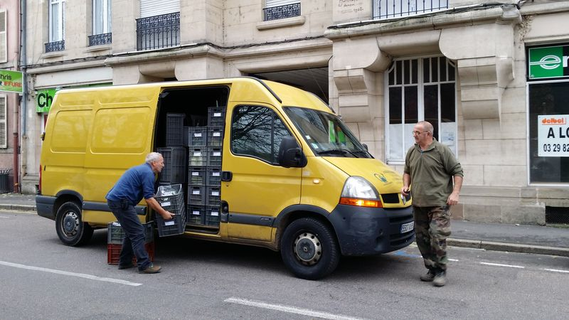

# Cahier des charges

### TL;DR

Un Jardin de Cocagne est une association composée de salariés permanents constituant l'équipe d'encadrement, de salariés en réinsertion professionnelle (chômeurs de longue durée, personnes en très grande difficulté sociale, réfugiés, etc.) et d'adhérents consommateurs.

Seuls les adhérents peuvent utiliser les services de l’association.

Les adhérents peuvent s'abonner à des paniers, de différentes tailles et composition.

Ces paniers sont livrés à des fréquences régulières (toutes les semaines, toutes les deux semaines, tous les mois) dans des dépôts. Les adhérents viennent chercher leurs paniers dans le dépôt.

Le système informatique devra comprendre un backoffice utilisé par l'équipe du Jardin pour gérer les abonnements et les livraisons et d'un frontoffice permettant aux adhérents de suivre leurs abonnements.

- [Brochure de présentation 2023](presentation/brochure-2023.pdf)
- [Brochure de présentation 2024](presentation/brochure-2024.pdf)

___

> [!WARNING]
> Ce document est un cahier des charges original donné par une structure nationale en vue de développer un système complet de gestion. Il vous expose à une mise en situation réelle. Il ne définit pas les priorités de développement, ni le rendu attendu pour cette situation d'apprentissage et d'évaluation. Quelques références au logiciel Dolibarr sont présentes dans ce document. Cette solution n'est finalement pas retenue et doit être ignorée.

### Objectifs du document

Ce document représente un cahier des charges pour la réalisation du futur logiciel de **gestion commerciale** des Jardins de Cocagne.

Il doit servir de base à la rédaction d'une proposition **technique** et **financière** de développement et de déploiement de ce logiciel.

Ce projet doit répondre à 2 enjeux majeurs pour le Réseau et les Jardins de Cocagne :

- Doter les jardins de cocagne d'un outil qui favorise le développement de leur activité économique mais aussi à terme les relations avec leur communauté d'adhérents et de partenaires économiques,
- Constituer un projet co-pensé et co-construit par les jardins de cocagne et non pensé par la tête de réseau au bénéfice de ses membres.

## 1. Structure

Un module de paramétrage initial doit permettre de saisir les données de la structure utilisatrice :

- Nom commercial
- Raison sociale
- Logo de la structure
- Siège social
- Adresse de gestion
- Coordonnées commerciales : téléphone, mail, nom éventuel de la personne de contact, site web
- N° de SIRET
- Coordonnées bancaires de la structure : BIC, IBAN, n° ICS
- Une case à cocher « structure assujettie / non assujettie à la TVA »

### Quelques structures

- [Jardins de Cocagne de Thaon-les-Vosges](https://thaonlesvosges.fr/ville-au-quotidien/emploi/les-structures-de-linsertion-par-lactivite-economique/les-jardins-de-cocagne/)
- [Le jardin de Cocagne Angevin](https://www.jardin-cocagne-angers.org/)
- [Les potagers de Velles](https://www.solidariteaccueil.org/les-potagers-de-velles)
- [Oasis](https://oasis.bio/index.php/paniers-bio/)
- [Lille](https://www.jardindecocagne-lille.org/content/23-je-decouvre)
- [Le jardin d'Ethan](https://jardindethan.fr/casier-en-libre-service/)
- [Graine de Cocagne](https://grainedecocagne.cocagnebio.fr/)
- [Jardin Julienne Javel](https://www.cocagneabonnement.org/paniers-de-legumes/)
- [Jardin de Macon](https://jdcmacon.org/contenu-des-paniers/)

## 2. Saisons

L’application doit permettre de définir et gérer la notion de saison, correspondant à l’année associative propre à chaque structure.

La saison représente la période de référence pour la vie de l’association : elle encadre la gestion des adhésions, des cotisations et des activités collectives (ex. : répartition des parcelles, organisation des livraisons, planification des fermetures).

Chaque saison est caractérisée par :

- une date de début** et une date de fin (qui peuvent différer de l’année civile),
- la possibilité d’indiquer des semaines de fermeture ou des jours fériés sans activité,
- un libellé permettant d’identifier facilement la saison (ex. : « Saison 2025 », « Printemps–Hiver 2026 », etc.).

La gestion multi-saisons doit être possible afin de conserver l’historique et de préparer la saison suivante tout en clôturant la précédente.

La structure doit définir de manière générale son calendrier livrable c'est-à-dire les jours et semaines où des livraisons sont possibles.

### 2.1 Semaines non livrables

La structure doit pouvoir définir, de manière globale les semaines non livrables, à cocher sur un calendrier.

### 2.2 Jours fériés

La prise en compte des jours fériés auront pour incidence de décaler la livraison sur un jour inhabituel de la même semaine (ex : mardi 8 mai férié, livraison décalée au mercredi 9 mai). Cette déclaration des décalages de livraison doit s'aborder jour férié par jour férié, et idéalement par tournée de livraison (exemple pour 2 tournées prévues les mardis, l'une pourrait être décalée au lundi et l'autre au mercredi pour des raisons d'organisation).

## 3. Dépôts

> [!NOTE]
> Les dépôts sont des lieux de livraison des produits commandés. Ils regroupent la plupart du temps plusieurs commandes, que les clients viennent chercher à cet endroit à un **jour** et **créneau horaire** précis.

Une fiche point de dépôt comprend :

- N° identifiant créé automatiquement (numéro unique, non modifiable)
- Identifiant de tournée et no d'ordre de livraison dans la tournée (cf. « [Tournée de livraison](#5-tournées-de-livraison) »).
- Nom du point de dépôt, adresse, code postal, ville, n° de téléphone (obligatoire pour l'enregistrement de la fiche)
- Mail générique de la structure, site web de la structure (facultatif)
- Nom de la personne référente + mail + téléphone spécifique de la personne référente
- On doit pouvoir préciser les jours de livraison de ce point de dépôt (incidence sur la commande et la feuille de route), le créneau horaire de livraison (information interne) et les créneaux horaires de récupération des paniers (apparaîtront en front office).
- Une zone de texte libre de présentation du lieu et le téléchargement possible d'une photo ou image du lieu.
- Prévoir une case de texte libre pour noter des commentaires.

### 3.1 Capacité d'accueil

Prévoir une case permettant de définir le nombre d'abonnements paniers maximum accueillis sur le point de dépôt. Cela induirait ensuite une fonction de vérification du nombre de places restantes pour valider une nouvelle inscription, et pourra définir un statut COMPLET de point de dépôt.

La capacité d'accueil doit être affichée dans l'espace d'information.

### 3.2 Catégories

Prévoir 3 catégories de points de dépôts à choisir en menu déroulant :

#### Dépôts ouverts à tous

ex : cas d'une boulangerie où n'importe qui peut se faire livrer un panier Ces PDD sont disponibles et affichés en tous lieux du front office.

#### Dépôts réservés à un public spécifique

ex : cas d'un comité d' entreprise ou seuls les salariés de l'entreprise peuvent s'y faire livrer un panier Ces PDD sont affichés publiquement sur le front office mais indiquent une petite phrase « réservé aux ... (texte personnalisable) ». Ils sont proposés dans le parcours de commande, mais le choix de ce PDD est soumis à validation par un mot de passe.

En back office, sur les fiches PDD appartenant à cette catégorie, on doit avoir une case où écrire le texte personnalisable et une case avec le mot de passe (unique et modifiable).

L'information « Point dépôt réservé aux texte personnalisable » si c'est un PDD Réservé à un public spécifique

Cette information doit être affichée dans l'espace d'information.

#### Dépôts professionnels

ex : cas d'une école qui commande des légumes pour sa cantine
En back office, sur les fiches PDD appartenant à cette catégorie, on doit pouvoir lier le lieu à une catégorie de client (cf. « 3.2 Clients »). En front office, ces PDD Professionnels n'apparaissent pas sur le site général, et n'apparaissent que dans le parcours de commande privé depuis les espaces clients des personnes appartenant à cette catégorie de client (cf. « 3.11 Parcours de Commande »).

Les catégories doivent s'afficher de manière différente sur la carte de localisation.

Sur la carte publique, ne doivent figurer que les PDD ouverts à tous et ceux réservés à un public spécifique (n'apparaissent pas les PDD professionnels). Dans les commandes des professionnels (catégories clients spécifiques), un onglet déroulant des PDD de leur catégorie sera suffisant si c'est plus simple.

Il serait pertinent que les indicateurs des points de dépôts puissent avoir une couleur différente : 1 couleur pour l'indicateur du PDD sur le site du Jardin de Cocagne, 1 couleur pour les PDD ouverts à tous, 1 couleur pour les PDD réservés à un public spécifique.

### Module de visualisation

Il faudrait prévoir un module de visualisation des tournées facilitant leur (ré)organisation. Ex : liste globale des PDD organisée par identifiant de tournée puis ordre de livraison, et prévoir une facilité pour les **reclasser** (changer l'ordre de livraison d'une tournée, changer un PDD de tournée.)

Un même point de dépôt peut appartenir à 2 tournées différentes, dans le cas où un même site propose 2 créneaux différents de livraison / récupération de paniers dans la semaine. Le client choisi un des 2 créneaux de livraison. A voir comment cette double appartenance sera gérée informatiquement (sélection du point de dépôt puis du jour 2).

Ce [module](https://sources.neotech.fr/Universite/sae5#rendu-15--d%C3%A9veloppement-back-office-1) fait partie de la liste des rendus.

## 4. Jours de préparation

Les jours de préparation sont des jours pendant lesquels tous les paniers appartenant à une ou plusieurs tournées sont préparés.

## 5. Tournées de livraison

Les points de dépôts sont livrés dans des **tournées de livraison**.

Une tournée de livraison est définie par :

- un identifiant de tournée qui doit pouvoir être personnalisable (chiffre ex : 1, 2, 3 ; ou lettre ex : tournée Ma ou V pour Mardi ou Vendredi, ou tournées BLR ou MTR pour Beaune la Rolande ou Montrouge.)
- un jour de préparation
- un jour de livraison
- une **succession ordonnées** de points de dépôts, définie grâce à un n° d'ordre de livraison dans la tournée, donner la possibilité de définir une couleur pour une tournée (la couleur a pour incidence de coloriser les PDD dans la partie gestion des PDD et synthèse des commandes à préparer et livrer / feuilles de route)

[Planning du mercredi](plannings/Planning%20mercredi.pdf)

## 6. Clients

Un client peut être une personne physique ou morale.

La fiche client comporte :

### 6.1 les éléments relatifs à son identité.

- N° identifiant créé automatiquement (numéro unique, non modifiable)
- Raison sociale (en cas de personne morale)
- Civilité (Mr / Mme...). Prévoir un onglet déroulant avec le contenu paramétrable dans les initialisations
- Nom, Prénom, Adresse, Code Postal, Ville, n° téléphone, mail. Rendre ces éléments obligatoires pour l'enregistrement de la fiche.
- 2ème et 3ème case de téléphone, Profession, date de naissance. Éléments facultatifs pour l'enregistrement de la fiche
- Mot de passe d'accès à son espace client « Mon compte » (créé automatiquement mais modifiable)
- Une ou plusieurs critères et zones de commentaires : son souhait de recevoir des SMS, son souhait de recevoir des e-mails...

### 6.2 Les éléments relatifs à son adhésion

- Date de 1ère adhésion,
- Historique des adhésions avec leur période et le type d'adhésion.
- Élément indiquant si l'adhésion est à jour ou non (réglée ou non réglée / en cours ou expirée), avec indication de la date d'expiration de la dernière adhésion.
- Une case « dispensé d'adhésion » à cocher, pour le cas de clients professionnels à qui l'on ne demande pas d'adhésion.

Pour le reste [cf. le paragraphe 7](#7-adhésions)

### 6.3 Les éléments relatifs à ses différentes commandes de produits ou d'abonnements

- Les commandes doivent pouvoir être réalisées, modifiées, ou visualisées depuis la fiche client. L'historique des commandes doit être présent, avec l'information du point de dépôt et les frais de livraison éventuellement associés, et un accès aux bons de livraisons et aux factures.

> Note : Il se peut qu'un client ait plusieurs abonnements en même temps (pas de limite de nombre).

Pour le reste cf le paragraphe 8

### 6.4 Les éléments relatifs à ses règlements

En particulier un pavé lié aux prélèvements, l'historique des règlements, les états des règlements, le solde en cours.

____

Il faut donner la possibilité aux structures de créer différents types de clients via des catégories (par ex : particuliers, AMAP, restauration collective, magasins, grossistes, salariés).

Cela permettra ensuite de personnaliser des offres (disponibilités produits, tarifs, lieu de livraison) par types de clients.

Dans ce cahier des charges le langage est simplifié pour clarifier les processus et élargir les possibilités de fonctionnement de l'outil.

Habituellement les adhérents-consommateurs du Jardins de Cocagne (abonnés aux paniers ou achat détail au marché) sont appelés les adhérents ; les autres types de ventes réalisées auprès clients de professionnels sont distingués. Or, dans ce cahier des charges on utilisera le terme « client » au sens large, pour toute personne physique ou morale qui va faire un acte d'achat auprès du Jardin de Cocagne (aussi bien un abonné aux paniers, qu'un particulier achetant au marché, qu'un professionnel passant une commande).

Le terme « adhérent » ne sera utilisé que dans le cadre de l'adhésion à l'association, qui est distincte et dissociée de l'acte d' achat (même si dans certains cas l'adhésion à l' association est obligatoire pour pouvoir effectuer certains actes d'achat).

## 7. Adhésions

> [!NOTE]
> Il sera nécessaire de distinguer l'adhésion à l'abonnement panier et l'adhésion à l'association Jardin de Cocagne avec la possibilité de lier automatiquement les deux dans le paramétrage de la structure.

Les deux sont liés, un adhérent panier est obligatoirement adhérent de l'association (l'inverse n'est pas vrai).

Un adhérent sans panier est appelé un **soutien**. Il devra être dans la liste des personnes convoquées aux assemblées générales de l'association.

### 7.1 Adhésion à l'association

> [!NOTE]
> Cette adhésion est la base pour calculer une partie de la cotisation annuelle que reverse le jardin au Réseau national.

Dans le cas des Jardins de Cocagne sous statut associatif (98 % des jardins), l'adhésion est obligatoire pour pouvoir accéder aux services et à la vente des produits de l'association. Tout client doit avant tout être adhérent, sauf cas particulier de clients professionnels à qui l'on ne demanderait pas d'adhésion (cf. case « dispensé d'adhésion » prévue sur la fiche client).

On peut proposer différents types d'adhésion à des prix différents (exemple Adhésion soutien, Adhésion solidaire… ) qui doivent être paramétrables dans l'outil : libellé + montant.

les adhésions sont valables sur une périodicité fixe déterminée par le Jardin.

La périodicité doit être paramétrable dans l'outil. ex : année civile 01/01 au 31/12, ou bien du 01/04 au 31/03.

En général, une adhésion prise en cours de période est facturée à plein tarif, et est valable jusqu'à la fin de la période en cours.

Les renouvellements d'adhésions sont tous appelés en même temps, avant la fin de la périodicité fixe.

Sauf cas particuliers

- Certains Jardins utilisent la notion de "date charnière" à paramétrer : c'est la date à partir de laquelle l'adhésion payée va jusqu'à la fin de la période suivante. Ex : si périodicité adhésion 01/01-31/12, et date charnière au 01/10 alors une inscription entre le 01/10 et le 31/12 année N sera valable jusqu'au 31/12 N+l.
- D'autres Jardins font une cotisation dégressive au trimestre en fonction de la période d'inscription de l'adhérent.

## 8. Produits

Les produits sont les différentes unités élémentaires qui peuvent être vendues. Cela peut être :

- des produits alimentaires (légumes, fruits, pain, œuf, ...) qui disposeront chacun d'une unité appropriée (pièce, kg, botte, filet, boîte, bouteille, colis)
- des lots composés de différents produits (ex : petit ou grand panier légumes, panier fruits, panier fermier . ou encore « composition ratatouille », « composition pot au feu » .
- des produits non alimentaires, matériels ou immatériels (ex : agenda, ecocup, adhésion, bon cadeau . . .)

id|produit|prix|marge
--:|---|--:|---
1|Panier simple  |13.80|40 %
2|Panier familial|23.70|40 %
3|Panier fruité 1|14.00|70 %
4|Panier fruité 3|23.00|70 %
5|Panier fruité 2|17.00|70 %
6|Oeufs x6       | 3.05|50 %
7|Panier fruité entreprise|23.50|70 %

Chaque produit dispose à minima d'un nom et d'une unité, et éventuellement d'une photo ou image et d'une description.

## 9. Abonnements / Panier

Un abonnement est un pack de vente d'un même produit livré régulièrement. Les abonnements peuvent concerner tous les types de produits : aussi bien les produits élémentaires (ex : abonnement boîtes d'œufs), que les lots de produits (ex : abonnement au panier fermier). C'est à la structure de déterminer les abonnements qu'elle propose. Les abonnements sont aussi appelés paniers.

### 9.1 Durée d'un abonnement

L'abonnement est lié à une période déterminée.

La structure définit la période type de l'abonnement grâce à des calendriers (ex : sur l'année civile, par trimestre, de Mai à Octobre. ..). Tout abonnement pris est paramétré jusqu'à la fin de la période. Un abonnement peut être démarré en cours de période et va jusqu'à la fin de la période, un calcul est donc fait sur le nombre de produits restant à recevoir d'ici la fin de la période.

### 9.2 Fréquence

Un panier lie un produit et une fréquence de livraison.

id|panier|produit|fréquence
--:|---|---|---
1|Panier simple hebdomadaire   |Panier simple   |hebdomadaire
2|Panier simple 15 jours       |Panier simple   |15 jours
3|Panier simple mensuel        |Panier simple   |mensuel
4|Panier familial hebdomadaire |Panier familial |hebdomadaire
5|Panier familial 15 jours     |Panier familial |15 jours
6|Panier familial mensuel      |Panier familial |mensuel

Par ailleurs, pour chaque type d'abonnement, la structure doit pouvoir paramétrer la ou les fréquences types proposées pour cet abonnement (hebdomadaire, tous les 15 jours semaines paires ou impaires, 1 fois par mois ...). Plusieurs fréquences peuvent être proposées au choix du client.

### 9.3 Démarrage, renouvellement et résiliation d'abonnement

Le démarrage d'abonnement peut se faire à tout moment. La date de démarrage peut être choisie et programmée en avance.

L'abonnement est programmé d'après les conditions de paramétrages définies par la structure (durée de l'abonnement, calendrier livrable, fréquence de livraison, modes de règlements, échéances de règlements etc.) et les options prises par le client parmi les choix proposés lors du parcours de commande (fréquence de livraison, jour de livraison, point de dépôt, mode de règlement et fréquence etc.).

Si une résiliation a été programmée pour cet abonnement (pour avant ou pour le jour de la fin de l'abonnement), alors l'abonnement n'est pas renouvelé.

### 9.4 Paniers solidaires ou offerts

Certains clients, comme les salariés en insertion, ont des paniers payés quelques % du prix public de vente.

Les adhérents peuvent acheter des paniers pour en faire dons

## 10 Calendrier

Un calendrier défini les jours de livraison, il respecte les contrainte de fermetures du jardin et les jours fériés.

Le calendrier est défini pour une fréquence et une tournée donnée.

Par exemple les calendiers des abonnements quinzomadaire (tous les 15 jours) pour la tournée du mardi matin défini les jours de livraison de ces paniers.

Il faut pouvoir ajuster les semaines de livraison par abonnements, mais aussi par tournées de livraison ou dépôts. En effet pour lisser la charge de travail et la production de légumes, les abonnements mensuels ne seront pas tous distribués la même semaine à tous les adhérents. Pour un même abonnement il existera un décalage de livraison.

## 11 Utilisateurs

Le module gestion des utilisateurs devra permettre de gérer un annuaire avec des profils de droits (ou groupes). Il serait souhaitable de ne pas distinguer des adhérents, de clients ou d'utilisateurs mais avoir un outil puissant de gestion des permissions.

### 11.1 Espace client « Mon compte »

- Ses coordonnées personnelles
- Ses coordonnées bancaires (prélèvement SEPA)
- Ses commandes en cours, avec calendrier et lieux de livraison prévus
- L'historique de ses commandes, de ses livraisons reçues et ses factures
- Le suivi de ses règlements effectués, les règlements prévisionnels programmés ou à recevoir, l'état de son solde
- En cas d'abonnement panier : la composition de son prochain panier à venir. L'affichage sera personnalisé grâce au module décrit en « Composition des paniers ».
- En cas d'abonnement panier : Les feuilles de chou de son panier (affichage ciblé selon son type de panier et tournée de livraison). Cf. « Modèles pour publipostage »
- En cas de client appartenant à une catégorie spécifique : le catalogue d'offre privée

Depuis cet espace, il pourra :

- Renseigner / Modifier ses coordonnées personnelles
- Renseigner / Modifier ses coordonnées bancaires (prélèvement)
- Déclarer une absence reporter ou annuler un produit selon l'option configurée par le Jardin de Cocagne
- Modifier son point de dépôt ponctuellement pour une livraison, ou définitivement pour toutes les livraisons d'un abonnement
- Modifier le jour de livraison de son abonnement (ponctuellement ou définitivement)
- Télécharger les factures relatives à ses commandes (v2.+)
- Effectuer un règlement de régularisation par carte bancaire ou par ordre de prélèvement  (v2.+)
- Télécharger les feuilles de chou de son panier  (v2.+)
- Effectuer une commande depuis le catalogue d'offre privée

## 12 Module de préparation et expédition

La page principale de ce module récapitule la synthèse des commandes à préparer par jour de préparation en quantité par type de produits.

Lorsque l'on clique sur une journée de préparation, on accède à la liste de l'ensemble des commandes à préparer pour cette journée. Cette liste peut être triée et filtrée selon différents critères (tournée de livraison, ordre des points de dépôt, type de clients, nom des clients, type de produits).

Le gestionnaire de commande édite alors trois documents :

- la feuille de préparation de commandes
- les étiquettes paniers
- les feuilles de route de livraison

### 12.1. Synthèse des commandes à préparer

Un onglet spécifique est dédié au récapitulatif des commandes à préparer et à livrer (état de commandes ou de produits « en préparation »). Cette synthèse est actualisée en permanence et est consultable en avance pour n'importe quelle date à venir. Les commandes passées sont consultables dans les archives.

Pour un jour de préparation défini, ou pour toutes les préparations de la semaine, il faut édter le détails des articles à livrer.

### 12.2 feuille de préparation de commandes

La feuille de préparation indique le nombre de panier à préparer. Trier par type de panier et par lieu de livraison

La feuille de préparation de commandes indique les noms des clients, le type de client, les produits commandés, le point de dépôt, le no de tournée.

Lors de l'édition, plusieurs modes de présentation peuvent être proposés selon le choix de la structure (ex : entrée par type de client puis type de produits, puis ordre alphabétique des clients / ou bien ex :  entrée par type de produits puis par point de dépôt puis par ordre alphabétique des clients)

En bas de page une synthèse indique le nombre de produits à préparer par types de produits.

### 12.3  Étiquettes paniers

Les étiquettes nominatives sont collées sur les cagettes. Elles permettent d'identifier à qui est destiné le panier.

Pour chaque panier une étiquette contenant le nom de l'adhérent, le type de produit et le dépôt est imprimée.

### 12.4 Feuille de route de livraison

La feuille de route de livraison d'une journée est ordonnée par tournées, puis par points de dépôts selon leur ordre de livraison.

Chaque tournée comporte une première page récapitulative de la tournée, indiquant la liste des points de dépôts dans l'ordre de livraison et le nombre de produits par type de produits à livrer sur chaque PDD.

Une synthèse totale est présente en bas de page.

Les pages suivantes sont dédiées au détail éléments à livrer sur chaque point de dépôt, avec un saut de page entre chaque PDD.

Pour chaque point de dépôt (avec rappel adresse, no téléphone et nom gérant), on retrouve la liste des produits et noms de clients à livrer, avec leur numéro de téléphone, et une case vide pour signature. Cette liste peut être ordonnée par nom des clients ou par type de produits selon le choix de la structure. Une synthèse du nombre de produits à livrer par types de produits est présente en bas de chaque page.

#### Validation

Sur la feuille de route, un bouton « valider que la livraison a été effectuée » permet de passer l'ensemble des produits figurant sur la feuille de route à l'état « livré ».

> À noter le besoin d'une très bonne ergonomie des documents de préparation des livraisons car ils seront utilisés par des non professionnels de la logistique. Un outil de paramétrage ou d'export vers des fichiers bureautiques ou la création peu complexe de modèles par des utilisateurs avertis (ex  modèles.odt Dolibarr) sera indispensable.

## 13. Composition des paniers

Le module de production permet de définir la constitution des paniers. A partir du stock de légumes disponible il faut pouvoir faire un répartition équitable et homogène des légumes.

Le prix cible du panier doit être respecté.

[Composition des paniers](autres/détail paniers.pdf)

## 14. Recettes

Idéalement, il faudrait que chaque saisie d'une recette sur un back office d'un des Jardins de Cocagne alimente une base de données commune. Les modules de recherche des front office de l'ensemble des Jardins iraient piocher dans cette base de données nationale.

## 15. Légalité

Le logiciel devra être en conformité avec l'ensemble des lesgislations, et en particulier avec :

- La loi informatique et libertés concernant la collecte, le traitement, la conservation et le droit de rectification de données personnelles, et la déclaration à la CNIL.
- La loi de finances concernant l'inaltérabilité, la sécurisation, la conservation et l'archivage des opérations.
- Les normes relatives au prélèvement SEPA et éventuellement autres normes concernant les autres modes de règlement.

Le prestataire devra nous accompagner sur les procédures éventuelles à mettre en œuvre dans ce cadre.

### 16. Charte

En s’abonnant à un Panier Cocagne, vous êtes assuré.e de contribuer à un projet :

- ayant pour priorité l’accueil et l’attention apportés aux personnes les plus vulnérables, sans discrimination ;
- qui respecte le sol et le vivant, dans une démarche de progrès écologique certifiée « Agriculture Biologique » ;
- qui défend l’accès digne de toutes et tous à une alimentation saine et durable produite et commercialisée dans le cadre de relations de confiance ;
- qui croit en la force du collectif et s’évertue à partager ses expériences, ses outils et à développer des dispositifs de coopération entre pairs ;
- qui participe à l’émergence d’une nouvelle économie au service des territoires et de la transition écologique et sociale.
